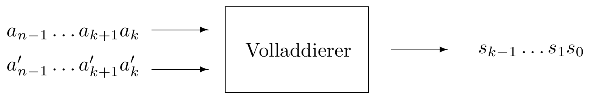

Die _endlichen Automaten_ stellen ein sehr einfaches Berechnungsmodell dar. In Abhängigkeit von einer Eingabe werden gewisse Fallunterscheidungen vorgenommen und unterschiedlich bearbeitet. Für die gesamte Berechnung wird nur ein begrenzter Speicherbereich benötigt, und die Berechnungsdauer hängt nur linear von der Länge der Eingabe ab. Zu den wichtigsten Anwendungsbereichen gehören der Schaltungsentwurf und die Sprachanalyse.

**有限自动机**是一种非常简单的**计算模型（Berechnungsmodell）**。  

它的基本思想是：   当接收到一个**输入（Eingabe）**时，自动机会根据输入的不同，**进行条件判断（Fallunterscheidungen）**，并据此执行不同的处理步骤。

在整个计算过程中：

- 自动机只需要**有限的存储空间（begrenzter Speicherbereich）**，  
    也就是说，它不会像计算机那样保存大量中间数据。    
- 它的**计算时间（Berechnungsdauer）**与输入的长度**呈线性关系**，  
    即输入越长，处理时间按比例增长。

因此，有限自动机的效率很高、模型简单、适合描述一些结构清晰、规则明确的计算过程。

---

**主要应用领域（Anwendungsbereiche）：**
1. **电路设计（Schaltungsentwurf）** —— 自动机可以用来描述逻辑电路的工作状态变化；
2. **语言分析（Sprachanalyse）** —— 特别是在**编译原理**中，用于**词法分析（Lexikalische Analyse）**和**语法识别（Syntaxanalyse）**等。

---

简而言之，有限自动机是一种“用有限状态和有限内存去识别输入序列”的理论模型，是计算理论和编译技术中的重要基础。

# 1 有限自动机

## 1.1 **Beispiel Ein-/Aus-Druckschalter** (无输出的有限自动机)

Ein sehr einfaches Beispiel ist ein Ein-/Aus-Druckschalter zum Schalten irgendeines Gerätes. Das Gerät erinnert sich, ob es “aus” oder “an” ist. Ist es “aus” und der Schalter wird gedrückt, so wird das Gerät eingeschaltet, ist es “an” und der Schalter wird gedrückt, so wird das Gerät ausgeschaltet. Das Gerät merkt sich also seinen Zustand. Seine Eingaben bestehen aus dem Drücken des Schalters. Graphisch läßt sich ein solches Modell eines endlichen Automaten in einem so genannten Zustandsgraph darstellen (Abbildung [Endlicher Automat Zustandsgraph](https://vfhti.eduloop.de/loop/Deterministische_Endliche_Automaten#fig_EA-ZGraph0)).

这段文字通过一个简单的例子——**“开/关按钮（Ein-/Aus-Druckschalter）”**——来说明**有限自动机（endlicher Automat）**的概念。

示例说明：
想象一个电器设备（例如灯），它有一个**按键开关**，用来控制设备的**开（an）**和**关（aus）**状态。
- 当设备是 **“关” (aus)** 状态时，如果按下按钮 → 设备被**打开（an）**。
- 当设备是 **“开” (an)** 状态时，如果按下按钮 → 设备被**关闭（aus）**。

自动机视角：

这个设备的行为可以看作一个**有限自动机（finite automaton）**，因为：
1. 它只有**两个状态（Zustände）**：
    - 状态 1：**aus（关）**
    - 状态 2：**an（开）**
2. 它的**输入（Eingabe）**是“按下按钮”这一动作。
3. 每次接收到输入后，自动机会根据当前状态**切换到另一个状态（Zustandsübergang）**：
    - aus → an

## 1.2 Beispiel Volladdierer  有输出的有限自动机

Als Weiteres wird ein Beispiel aus dem Schaltungsentwurf vorgestellt. Dieses führt zu endlichen Automaten, die auch eine Ausgabe erzeugen. Gegenüber den endlichen Automaten ohne Ausgabe stellen diese einen allgemeineren Ansatz dar. Detailliert werden dann aber die Modelle und Verfahren aus der Sprachanalyse behandelt, die wie Beispiel [Ein-/Aus-Druckschalter](https://vfhti.eduloop.de/loop/Deterministische_Endliche_Automaten#bsp_EinAus) keine explizite Ausgabe erzeugen.

接下来将介绍一个**来自电路设计（Schaltungsentwurf）**的例子。  
这个例子将引出一种**可以产生输出（Ausgabe）**的**有限自动机（endlicher Automat）**。

与**不产生输出**的有限自动机相比，这种自动机是一种**更通用的模型**，  
因为它不仅能根据输入改变状态，还能**生成输出信号**。

不过，在后续的讨论中，将主要关注**语言分析（Sprachanalyse）**相关的模型和方法，  
这些模型与“**开/关按钮（Ein-/Aus-Druckschalter）**”的例子类似，  
**不会产生显式的输出**，  
而是仅根据输入符号的序列判断状态变化或接受情况。

----

Ein so genannter _Volladdierer_ addiert zwei nicht-negative ganze Zahlen in binärer Darstellung seriell. Die

n

-stelligen Summanden

a=(an−1…a1a0)2

und

a′=(a'n−1…a'1a'0)2

werden synchron getaktet, ziffernweise an den Volladdierer gegeben. Dieser addiert die jeweiligen Ziffern und gibt die berechneten Summenziffern entsprechend getaktet aus. Ein ggf. auftretender Übertrag wird intern bis zum nächsten Takt zwischengespeichert und dann berücksichtigt. Das Verfahren entspricht dem Vorgehen bei der so genannten _Papier-und-Bleistift-Methode_ zur Addition von Zahlen.

所谓的**全加器（Volladdierer）**以**串行方式**对两个**非负整数的二进制表示**进行加法运算。
这两个由 nnn 位组成的加数

a=(an−1…a1a0)2a = (a_{n−1} … a_1 a_0)_2a=(an−1​…a1​a0​)2​
和
a′=(a′n−1…a′1a′0)2a′ = (a′_{n−1} … a′_1 a′_0)_2a′=(a′n−1​…a′1​a′0​)2​

在同步时钟控制下，**逐位（ziffernweise）**输入到全加器中。

全加器对相应的位进行相加，并在时钟的节奏下输出计算出的**和位（Summenziffern）**。  
如果产生了**进位（Übertrag）**，则该进位会在内部暂存到下一个时钟周期，并在下一步计算中予以考虑。

这种方法与我们熟知的**“笔算加法（Papier-und-Bleistift-Methode）”**的过程是一致的。

---

Ein Volladdierer hat taktweise die folgende _Schaltfunktion_ zu berechnen:

f:{0,1}3→{0,1}2 mit f(ak,a'k,ck)=(s,c).

Dabei ist

s:{0,1}3→{0,1} mit s(ak,a'k,ck)=sk und

c:{0,1}3→{0,1} mit c(ak,a'k,ck)=ck+1,

wobei die Summenziffer sk und der Übertrag für den nächsten Takt ck+1 durch die nachfolgende Tabelle definiert werden:

|   |   |   |   |   |   |   |   |   |
|---|---|---|---|---|---|---|---|---|
|ak|0|0|1|1|0|0|1|1|
|a'k|0|1|0|1|0|1|0|1|
|ck|0|0|0|0|1|1|1|1|
|sk|0|1|1|0|1|0|0|1|
|ck+1|0|0|0|1|0|1|1|1|

|( a_k )|( a'_k )|( c_k )|( s_k )|( c_{k+1} )|
|:-:|:-:|:-:|:-:|:-:|
|0|0|0|0|0|
|0|1|0|1|0|
|1|0|0|1|0|
|1|1|0|0|1|
|0|0|1|1|0|
|0|1|1|0|1|
|1|0|1|0|1|
|1|1|1|1|1|

---

Der Volladdierer hat also während einer Berechnung zwei verschiedene interne _Zustände_ zu berücksichtigen: Beim vorangehenden Takt ist kein Übertrag aufgetreten, ck=0, oder beim vorangehenden Takt ist ein Übertrag aufgetreten, ck=1. Zu berücksichtigen ist die Initialisierung des Zustands mit c0=0 und der für die Gültigkeit der Berechnung notwendige Schlusswert cn=0.

Die Berechnung des Volladdierers in Abhängigkeit von den Summandenziffern und seinem aktuellen Zustand kann durch einen so genannten _Zustandsgraph_ dargestellt werden. Die Knoten des Graphen repräsentieren die Zustände, die gerichteten Kanten die Zustandsüberführungen. Die jeweiligen Ein- und Ausgaben werden den Kanten in der Form (ak,a'k)/sk angefügt. Ein Pfeil markiert den initialen Zustand (Abbildung [Zustandsgraph Volladdierer](https://vfhti.eduloop.de/loop/Deterministische_Endliche_Automaten#fig_EA-ZGraph1)).

因此，在一次计算过程中，全加器需要考虑两个不同的**内部状态（interne Zustände）**：

- 如果在前一个时钟周期**没有产生进位**，则 ck=0；
    
- 如果在前一个时钟周期**产生了进位**，则 ck=1。
    

还需要注意状态的初始化条件和计算的结束条件：

- **初始状态**：c0=0c_0 = 0c0​=0（开始时没有进位）；
    
- **结束状态**：cn=0c_n = 0cn​=0，这是确保整个加法计算正确完成所必须满足的条件。
    

----

根据加数各位数字以及当前状态，全加器的计算过程可以用一个所谓的**状态图（Zustandsgraph）**表示：
- 图中的**节点（Knoten）**表示不同的**状态**；
- **有向边（gerichtete Kanten）**表示**状态之间的转移（Zustandsüberführungen）**；
- 每条边都带有输入和输出标记，格式为 **(aₖ, a′ₖ) / sₖ**，  
    表示输入是加数的当前两位 aka_kak​ 和 ak′a'_kak′​，输出是对应的和位 sks_ksk​。
- 其中一个箭头标记初始状态。
（如图：**“全加器的状态图（Zustandsgraph Volladdierer）”** 所示。）

# 2 Mealy 自动机和 Moore 自动机。

Die Abstrahierung dieses Beispiels zu einem Automatenmodell führt zu den _Mealy-Automaten_ und _Moore-Automaten_. Das sind endliche Automaten, die taktweise eine auf einem Eingabeband befindliche Eingabe verarbeiten und auf einem Ausgabeband eine Ausgabe erzeugen. Dabei durchlaufen sie eine von der Eingabe abhängige Zustandsfolge. Während bei einem Mealy-Automaten die Ausgabe von dem aktuellen Zustand und dem jeweiligen Eingabezeichen abhängt, hängt die Ausgabe beim Moore-Automaten ausschließlich vom aktuellen Zustand ab. Das Beispiel in Abbildung [Zustandsgraph Volladdierer](https://vfhti.eduloop.de/loop/Deterministische_Endliche_Automaten#fig_EA-ZGraph1) stellt einen Mealy-Automaten dar.

将上述例子抽象为一个自动机模型后，就得到了**Mealy 自动机**和 **Moore 自动机**。  
这两种都是**有限自动机（endliche Automaten）**，它们在时钟的节奏下逐步读取输入带（Eingabeband）上的输入，并在输出带（Ausgabeband）上产生输出。  
在此过程中，自动机会根据输入序列**依次经过一系列状态（Zustandsfolge）**。
- 在 **Mealy 自动机** 中，**输出取决于当前状态和当前输入符号**。
- 而在 **Moore 自动机** 中，**输出只取决于当前状态**。
    
前文中“全加器状态图（Zustandsgraph Volladdierer）”的例子就是一个 **Mealy 自动机**。

---

Der Einsatz von endlichen Automaten zur Analyse und Erkennung formaler Sprachen – als _Sprachakzeptor_ – kennt als Ausgabe aber nur die beiden Alternativen _Ja_ und _Nein_, und dazu wird kein Ausgabeband benötigt. Solche Automaten sollen im Folgenden beschrieben und bzgl. ihrer Eigenschaften analysiert werden.

在**形式语言的分析与识别**中，有限自动机作为一种**语言识别器（Sprachakzeptor）**使用。  
此时，它的输出只有两种可能：**“是（Ja）”或“否（Nein）”**，  
因此不需要单独的输出带。  
接下来将介绍这类自动机的定义，并分析其性质。

---

Ein _endlicher Automat_ (EA) besteht aus einer Steuereinheit und einem Eingabeband mit Lesekopf. Die Steuereinheit enthält das Steuerungsprogramm des Automaten und einen endlichen Speicher, in dem die jeweiligen Zustände gespeichert werden. Mittels der _endlich_ vielen Zustände kann sich der Automat _endlich_ viel merken. Das Eingabeband enthält das zu analysierende Eingabewort, die Eingabe. Das Band ist in Felder unterteilt, wovon jedes Feld genau ein Eingabezeichen aufnimmt. Über den Lesekopf werden die Zeichen von der Steuereinheit gelesen (Abbildung [Endlicher Automat](https://vfhti.eduloop.de/loop/Deterministische_Endliche_Automaten#fig_EA)).

一个**有限自动机（EA, Endlicher Automat）**由两部分组成：
1. 一个**控制单元（Steuereinheit）**
2. 一个带有**读头（Lesekopf）**的**输入带（Eingabeband）**。

控制单元包含自动机的**控制程序（Steuerungsprogramm）**以及一个**有限的存储器（endlicher Speicher）**，  
用于存储自动机当前的**状态（Zustand）**。  
由于状态数量有限，自动机只能“记住”有限的信息。

输入带上写着需要分析的**输入词（Eingabewort）**，  
它被分为若干**格子（Felder）**，每个格子中恰好存放一个输入符号。  
读头逐个读取这些符号，并将它们传递给控制单元进行处理。

（参见图示：**有限自动机（Endlicher Automat）**。）

---

Initial befindet sich der Automat in einem besonderen Zustand, dem Startzustand. Auf dem Eingabeband befindet sich die Eingabe. Das Band hat jeweils genau die Länge der Eingabe, also die Anzahl der Felder auf dem Band entspricht genau der Zeichenanzahl des Eingabewortes. Das Eingabewort wird getaktet von links nach rechts abgearbeitet, der Lesekopf befindet sich also initial auf dem Feld ganz links. Der Automat liest in einem Takt das Zeichen unter dem Lesekopf und geht in Abhängigkeit von diesem Zeichen und dem aktuell gespeicherten Zustand in einen Folgezustand über. Der Lesekopf rückt ein Feld nach rechts weiter. Es folgt der nächste Takt. Der Automat beendet die Analyse, wenn das letzte Zeichen der Eingabe verarbeitet ist.

Entsprechend dem Schema eines endlichen Automaten sind Mealy- und Moore-Automaten im Wesentlichen nur um ein Ausgabeband mit Schreibkopf erweitert (Abbildung [Endlicher Automat mit Ausgabe](https://vfhti.eduloop.de/loop/Deterministische_Endliche_Automaten#fig_EAmA)). Die Ausgabe wird synchron mit dem Verarbeitungsfortschritt der Eingabe erzeugt.

最初，自动机处于一个特殊的状态——**初始状态（Startzustand）**。  
输入带（Eingabeband）上写有输入内容（Eingabe），  
其长度**正好等于输入的长度**，也就是说，  
带上的格子数量与输入词的字符数完全一致。

输入词会按照时钟节奏**从左到右**逐步被处理，  
因此，**读头（Lesekopf）**最开始位于最左边的格子上。

在每一个时钟周期中：
- 自动机会**读取**读头下的符号，
- 并根据**当前状态**和**该输入符号**，**转移到下一个状态（Folgezustand）**。  
    随后，读头**向右移动一个格子**，  
    进入下一个周期。

当输入的**最后一个符号**被处理完时，  
自动机的分析过程随之结束。

根据有限自动机的基本结构，  
**Mealy 自动机**和 **Moore 自动机**可以看作是在其基础上**扩展了一个带有写头的输出带（Ausgabeband mit Schreibkopf）**的模型。  
输出会**与输入处理的节奏同步**生成。

Formal wird ein endlicher Automat durch ein 5-Tupel beschrieben (Definition [Deterministischer Endlicher Automat](https://vfhti.eduloop.de/loop/Deterministische_Endliche_Automaten#def_DFA)).

# 3 **Deterministischer Endlicher Automat** 的定义 

## 3.1 5-Tupel

Ein 5-Tupel E=(Q,Σ,δ,q0,F) heißt **deterministischer endlicher Automat** (DEA) oder kurz endlicher Automat, falls gilt:

- Q   ist eine endliche nicht-leere Menge, die Zustandsmenge
    
- Σ   ist ein Alphabet, das Eingabealphabet
    
- δ:Q×Σ→Q   ist eine Funktion, die Zustandsüberführungsfunktion oder auch Überführungsfunktion
    
- q0∈Q   ist der Startzustand
    
- F⊆Q   ist die Menge der Endzustände oder der akzeptierenden Zustände

---

## 3.2 deterministische Variante eines endlichen Automaten

这里首先讨论**确定性有限自动机（deterministische Variante eines endlichen Automaten）**。  
所谓确定性自动机，是指：  
对于每一个由**输入符号**和**当前状态**组成的**有序对**，都**恰好定义了一个唯一的后继状态（Folgezustand）**。  
换句话说，同样的输入和状态，永远只会导致一种确定的状态转移。  
（稍后将引入**非确定性（Nichtdeterminismus）**的概念。）

 zusstand muss deterministische sein
- In jede Zustand ist die richtung eindeutig, 不能通过 a 从 0 到 1, 或者从0 通过a 也到2 ，
- Zustande ist eindeutig

## 3.3 状态转移表（Überführungstabelle）

**状态转移函数 δ（Überführungsfunktion δ）**定义了自动机的“程序”——  
它描述了在给定输入和状态下，自动机应如何变化。

通常，这个状态转移函数会以一种称为**状态转移表（Überführungstabelle）**的形式记录下来。  
表 **2.1** 指定了其中**每一列的具体含义**。

这样的**状态转移表（Überführungstabelle）**由有限多行组成。  
对于 δ 的每一个参数对 (q,x)∈Q×Σ(q, x) \in Q \times \Sigma(q,x)∈Q×Σ，表中必须**恰好包含一行**。
- **初始状态（Startzustand）**前面会加一个箭头（→ 或 ▷）标记；
- **终止状态（Endzustände）**前面会加一个星号（*）标记。

状态转移表也可以**以矩阵（Matrix）形式排列**：
- **行（Zeilen）**对应自动机的各个状态；
- **列（Spalten）**对应输入符号；
- 每个单元格（矩阵元素）记录该状态在对应输入下的**后继状态（Folgezustand）**。

## 3.4 **状态图（Zustandsgraph）

一个有限自动机可以通过一个**有向标记图（gerichteter Graph）**来描述，  
这个图也称为**状态图（Zustandsgraph）**、**状态图示（Zustandsdiagramm）**或**转移图（Überführungsgraph）**。

- 图中的每一个**节点（Knoten）**对应一个状态（Zustand）。
- 两个节点 q 和 q′ **只有在**自动机从当前状态 qqq 在输入 xxx 下转移到后继状态 q′q'q′ 时，才通过一条**有向边（gerichtete Kante）**从 qqq 指向 q′q'q′ 相连。
- 这条边会标注输入符号 xxx。
- **初始状态（Startzustand）**用一个指向它的箭头标记；
- **终止状态（Endzustände）**用**双圈（Doppelkreis）**表示。

## 3.5 Beispiel: **Berechnung eines endlichen Automaten**

Die Arbeitsweise und das Ergebnis einer Berechnung eines endlichen Automaten ist informell bereits oben beschrieben worden. Einen formalen Ansatz dafür liefert Definition [Berechnung eines endlichen Automaten](https://vfhti.eduloop.de/loop/Deterministische_Endliche_Automaten#def_CompDFA).

# 4 Berechnung eines endlichen Automaten: Sprache einer Automaten

Sei E=(Q,Σ,δ,q0,F) ein endlicher Automat und sei w=x1x2…xn ein Wort, bei dem jedes xi∈Σ, 1≤i≤n. E **akzeptiert** dann w, falls eine Zustandsfolge r0,r1,…,rn in Q unter drei Bedingungen existiert:

1. r0=q0,
2. δ(ri,xi+1)=ri+1, für i=0,1,…,n−1,
3. rn∈F.

Man sagt dann, dass E die Sprache L erkennt, falls L={w∣E akzeptiert w},  
geschrieben L(E)=L.

设 E=(Q,Σ,δ,q0,F)E = (Q, \Sigma, \delta, q_0, F)E=(Q,Σ,δ,q0​,F) 是一个有限自动机，  
并且 w=x1x2…xnw = x_1 x_2 … x_nw=x1​x2​…xn​ 是一个单词，其中每个 xi∈Σx_i \in \Sigmaxi​∈Σ，且 1≤i≤n1 \le i \le n1≤i≤n。

如果存在一个状态序列 r0,r1,…,rn∈Qr_0, r_1, …, r_n \in Qr0​,r1​,…,rn​∈Q 满足以下三个条件，则称 EEE **接受（akzeptiert）**这个单词 www：

1. 初始状态：r0=q0r_0 = q_0r0​=q0​；
    
2. 状态转移：δ(ri,xi+1)=ri+1\delta(r_i, x_{i+1}) = r_{i+1}δ(ri​,xi+1​)=ri+1​ 对 i=0,1,…,n−1i = 0,1,…,n-1i=0,1,…,n−1 成立；
    
3. 终止状态：rn∈Fr_n \in Frn​∈F。
    

如果 EEE 能够接受所有属于某个语言 LLL 的单词，则称 EEE **识别（erkennt）**语言 LLL，  
即

L={w∣E akzeptiert w},记作 L(E)=L.L = \{ w \mid E \text{ akzeptiert } w \}, \quad \text{记作 } L(E) = L.L={w∣E akzeptiert w},记作 L(E)=L.

## 4.1 Berechnung eines DEA mit konkreten Eingaben

Gern — ich fasse das Ganze knapp, klar und strukturiert zusammen und gebe die Idee des Beweises per Induktion dazu.

### 4.1.1 Was ist gegeben?

Ein deterministischer endlicher Automat EEE (mit Zuständen {0,1,2}\{0,1,2\}{0,1,2}, Startzustand 000 und Endzustand(en) F={0}F=\{0\}F={0}).  
Eingabealphabet Σ={a,b}\Sigma=\{a,b\}Σ={a,b}.

![[Pasted image 20251031220434.png]]

### 4.1.2 Ablauf der Berechnung (Lesekopf / Takt-Notation)

![[Pasted image 20251031220503.png]]

### 4.1.3 Erkannte Sprache  L(E)

![[Pasted image 20251031220552.png]]

### 4.1.4 Wie beweist man das formal

![[Pasted image 20251031220609.png]]

## 4.2 Alphabet eines DEAs

Wie in Abschnitt [Zusammenhang mit Programmiersprachenmerwähnt](https://vfhti.eduloop.de/loop/Zusammenhang_mit_Programmiersprachen "Zusammenhang mit Programmiersprachen") lassen sich die elementaren Einheiten eines Programms durch das Modell eines endlichen Automaten analysieren und erkennen. Das folgende Beispiel zeigt den Ansatz für den Aufbau eines lexikalischen Analysators (Scanners). Das Beispiel wird dann im nächsten Abschnitt fortgeführt.

![[Pasted image 20251031220708.png]]

Sei das zugrunde liegende Alphabet
Σ={a,b,…,z,0,1,…,9}

1. Ein Identifikator bzw. Bezeichner besteht aus einem Wort w, beginnend mit einem Buchstaben und gefolgt von keinem oder endlich vielen Buchstaben oder Ziffern: w∈{a,b,…,z}{a,b,…,z,0,1,…,9}∗ , Der Einfachheit halber sei auf Großbuchstaben verzichtet. Ein endlicher Automat EI, der Identifikatoren akzeptiert, ist in Abbildung [Endlicher Automat EI](https://vfhti.eduloop.de/loop/Deterministische_Endliche_Automaten#fig_EA-ZGraph3aa) dargestellt. EI akzeptiert aber auch die reservierten Wörter als Identifikatoren.
2. Ganze Zahlen ohne Vorzeichen bestehen aus einem Wort w aus endlich vielen Ziffern: w∈{0,1,2,…,9}+ Ein endlicher Automat EZ, der solche Zahlen akzeptiert, ist in Abbildung [Endlicher Automat EZ](https://vfhti.eduloop.de/loop/Deterministische_Endliche_Automaten#fig_EA-ZGraph3bb) dargestellt. 
3. as reservierte Wort bzw. Schlüsselwort for besteht aus der Konkatenation der Zeichen f⋅o⋅r.  Ein endlicher Automat Efor, der dieses Wort akzeptiert, ist in Abbildung [Endlicher Automat Efor](https://vfhti.eduloop.de/loop/Deterministische_Endliche_Automaten#fig_EA-ZGraph3cc) dargestellt.

In den folgenden Abbildungen zu diesem Beispiel gelten die nachstehenden abkürzenden Schreibweisen:
buchstabe∈{a,b,c,…,z}
ziffer∈{0,1,2,…,9} xf∈Σ∖{f} xo∈Σ∖{o} xr∈Σ∖{r}

![[Pasted image 20251031220902.png]]

![[Pasted image 20251031220909.png]]

![[Pasted image 20251031220916.png]]

# 5 2025-10-24 在线课程

## 5.1 我们想要建立一个Tomaten zu der Sprache

Aphabet {0, 1}

Spache ist aller Worter mit w,   w ist das leere Wort,oder enthalt nur 一些列的 Nullen 值

![[Pasted image 20251031221127.png]]

q0 -> q0 für eingabe eps, 0; q0 -> q1 füe eingabe 1: endzustand q0

Epsilon und 0

ist eine beliebig gewählte Sprache

 Wir haben gesagt,  die Menge aller Wörter die der Automat erkennt, ist es eine Sprache und hier sage ich hier ist deine Sprache. 

所以说

## 5.2 Definieren wir ein Automaten

Einen greade Anzahle von null und eine gerade Anzahl von eins

![[Pasted image 20251031221146.png]]

就是说 产生的zustande 连起来， 只能 得到 一连串的 奇数个0以及奇数个1

===

按照他的要求 ， 我们得到下面的设计

Q0 是开始的点

===

下面是不对的， 因为很有可能 只包含1 或这个 0，  我们的要求必须 得到 一连串的 奇数个0以及奇数个1

![[Pasted image 20251031221157.png]]

![[Pasted image 20251031221202.png]]

![[Pasted image 20251031221205.png]]

## 5.3 鉴别 problematische Automaten

eine Automate  ist falsch. wenn entweder dann wenn er ein Wort seiner Sprache nicht erkennen
 Oder wenn er ein Wort erkennen(erzeugen), was nicht zu seiner Sprache gehört .

----

![[Pasted image 20251031221243.png]]

Problem是从q0, 用 wort 1, 可以到 q1 或者到 q0,  这不符合 automate 的要求
双圈代表 endpoint

---

![[Pasted image 20251031221255.png]]

Welche sprache  kann er sprechen:

Alle Woeter, Der vorletzten Zeichen ist 1 muss

alle die mit 1 an dritter stelle von hinten haben

他说不出 000

Automaten ist nciht einduetig , 因为q0 说1，可以到 q1 或者到q0

---

![[Pasted image 20251031221304.png]]

E 是 epsilon

Welche Woeter erkannt das Automaten :

Automaten  erkennt alle Woerter

bzw. a^x, b^x, c^x

X ist ein belibeige Zahnl von 0 bis unendlich

Automaten kann die Worter sprachen, die Belibige zahl von A, dann gefolgt von Belibigen Anzahl vonb, dann  gefolgt von Belibigen Anzahl von c , bestehen

Die alle nWortter, die a, b,c folgen, 不能再说b了， 如果已经到b 了. 不能再说ab, 了， 如果 到了c. 

Er kommt von b nicht zu a

Die Reihenfolge ist wichtig, weil von b kann man nicht auf a zurück

