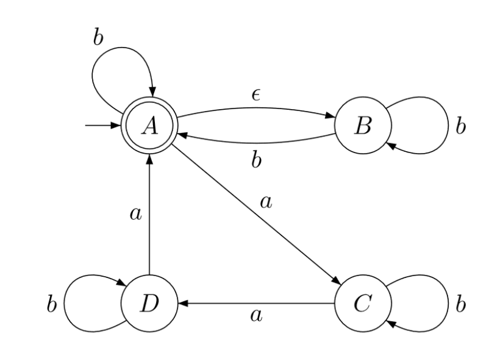

Der _Nichtdeterminismus_ erweitert das Konzept der deterministischen Verarbeitungsweise. Bezogen auf endliche Automaten bedeutet die deterministische Verarbeitungsweise, dass je Zustand und gelesenem Zeichen genau ein Folgezustand definiert ist. 

Ein nichtdeterministischer endlicher Automat lässt dagegen je Zustand und gelesenem Zeichen **keinen** bis **mehrere Folgezustände** zu. 
Des weiteren kann es auch Zustandsüberführungen geben, ohne dass ein Zeichen des Eingabebandes gelesen wird, so genannte ϵ**-Überführungen**. Betrachte dazu das [Beispiel NEA](https://vfhti.eduloop.de/loop/Nichtdeterministische_endliche_Automaten#bsp_NEA).

非确定性扩展了确定性处理方式的概念。  
对于有限自动机而言，**确定性处理方式**意味着对于每一个状态和读取的字符，**恰好有一个后续状态**被定义。

而**非确定性有限自动机**则允许对于每一个状态和读取的字符，存在 **零个、一个或多个后续状态**。  
此外，还可以存在在不读取输入带上任何字符的情况下进行的状态转换，这种转换称为 **ε-转换**。

请参考 NEA 的示例以进一步理解。

Es handelt sich um einen nichtdeterministischen endlichen Automaten, weil der Zustand A eine ϵ-Überführung hat und der Zustand B für die Eingabe a keinen Folgezustand und für die Eingabe b zwei Folgezustände hat.

这是一个**非确定性有限自动机**，因为状态 **A** 存在 **ε-转换**，而状态 **B** 对输入 **a** 没有后续状态，对输入 **b** 则有两个后续状态。

----

> 还是有有一个限定条件就是 但是同一个 zustand 同一个 zeichenn, 只能只想 同一个 zustand, 下去就是不成立的

damit kann nicht garantiert werden, dass b der vorletzte Buchstabe ist

Eb:  letzte Zeichen muss b sein
Ea:  letzte Zeichen muss a sein

# 1 NEA 转成 DEA 的方式 

das eine Verfahren ist teilmengenkonstruktion und
das zweite Verfahren ist die sogenannte reservation.

## 1.1 teilmengen-konstruktion

### 1.1.1 Beispiel 

---

1 Ohne Berucksichtung der Epsilon-Uberfuhrung

{A,B} ,
A-a-C,   B-a-lerrmeneg, dann A
A-b-A,  B-b-{A,B}， 融合 A 和 {A，B} 后  得到 {A,B}

---

2 Berucksichtiung der Epsilon Uberfurhungen 

E（R）  就是 当前zustand, 什么zeichen 也不执行得到的 zustand  （得到zustand 就是目前的zustand 本身 ）,  和执行 epislon zeichen 后的得到的zustand

----

3 合并 

Fur jede Worter  wir E() dafur

---

4

Wenn b kommt,.

Wenn a kommt

Wenn c komm 

Wenn d bin, und b kommt

Wenn d bin, un  b kommt , dann welchen ins a,

Und AB ist eine endlich zustand, 因为再下面中定义了 

